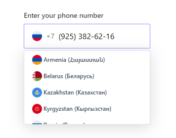
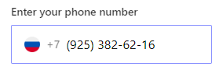

# masked-input

Simple masked Input for VueJs




## install
```sh
npm i @wsofter/masked-input
```


## Props
  Interface:
  ```ts
  interface Props {
    value?: string;
    label?: string;
    hasError?: boolean;
    hasSuccess?: boolean;
    successMessage?: string;
    errorMessage?: string;
    placeholder?: string;
    name?: string;
    required?: boolean;
    defaultCountry?: string;
    arrow?: boolean;
    listHeight?: number;
    allowed?: string[];
    maska?: string;
    icons?: any[];
    firstCountry?: string;
 }
  ```

 Default values:
 ```js
 {
  value: "", // like '79253826216', ${dialCode}${nationalNumber}
  label: "",
  hasError: false,
  hasSuccess: false,
  successMessage: "",
  errorMessage: "",
  placeholder: "",
  name: "",
  required: false,
  defaultCountry: "RU",
  arrow: true,
  listHeight: 150,
  allowed: () => ["RU", "UA"],
  maska: "",
  icons: [],
  firstCountry: ""
 }
 ```

 ## Slots

 ### arrow
 ```html
 <!-- to change arrow icon-->
 <masked-input>
  <template #arrow><icon /><template>
 </masked-input>
 ```

 use global slot to append content at the end of the component.
 ```html
 <masked-input>
   <div>Hello</div>
 </masked-input>
 ```


## Use
 main.ts :
 ```js
  import { maskedInput } from '@wsofter/masked-input';

  // register as global component
  app.component('maskedInput', maskedInput);
 ```
 App.vue :
 ```js
 // import component style
 import '@wsofter/masked-input/style';
 ```

 use component:
 ```html
    <masked-input
      @maskedValue="maskedValue = $event"
      @country="country = $event"
      @maskedData="maskedData = $event"
      name="cmasked"
      label="Enter your phone number"
      required
      :allowed="[]"
      :value="'79253826216'"
      maska="(###) ###-##-##"
    />
 ```
 

 ```js
  console.log(maskedValue) : 7(925) 382-62-16
  console.log(country) : RU
  console.log(maskedData) : { "country": "RU", "dialCode": "7", "nationalNumber": "9253826216", "number": "+79253826216", "isValid": true }
 ```

 ## Use it with Vee-validate

 Sample wrapper code:

 ```html
 <template>
  <masked-input
    :has-error="hasError"
    :errorMessage="errorMessage"
    @maskedData="validateMasked"
    ref="maskedInput"
    maska="##-##"
  />
</template>
```
```ts
<script lang="ts">
import { useField } from 'vee-validate';
import { computed, onMounted, getCurrentInstance } from 'vue';

interface IMaskedData {
  country?: string;
  dialCode?: string;
  nationalNumber?: string;
  number?: string;
  isValid?: boolean;
}

export default {
  setup(props: any, context: any) {
    const that: ComponentInternalInstance | null = getCurrentInstance();

    const {
      value: inputValue,
      errorMessage,
      handleBlur,
      handleChange,
      meta,
    } = useField(context.attrs.name, undefined, {
      initialValue: context.attrs.value ? context.attrs.value : '',
      validateOnValueUpdate: false,
    });

    // compute error from vee-validate
    const hasError = computed((): boolean => {
      return errorMessage.value !== undefined;
    });

    const validateMasked = (data: IMaskedData) => {
      handleChange(data.nationalNumber, false);
      context.emit('inputData', data);
    };

    onMounted(() => {
      if (that?.refs.maskedInput.maskedValue) {
        handleChange(that.refs.maskedInput.maskedValue);
      }
    });

    return {
      hasError,
      errorMessage,
      validateMasked,
    };
  },
};
</script>
```

